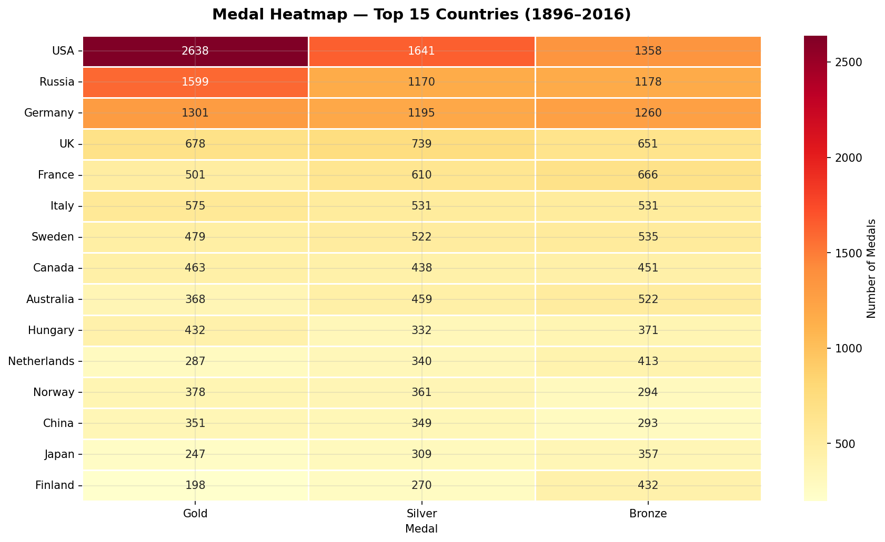

# Olympics Dataset Analysis

## Overview
Analysis of 120 years of Olympic history using the real Kaggle 
dataset — 271,116 athlete-events from Athens 1896 to Rio 2016. 
Explores medal dominance, participation growth, gender equity 
evolution, sport patterns, and athlete physical profiles.

## Dataset
- **Source:** Kaggle — 120 years of Olympic history
- **License:** CC0 Public Domain
- **Records:** 271,116 rows × 15 columns
- **Files:** athlete_events.csv + noc_regions.csv

## Key Results
- Total athletes: 135,571 unique competitors
- Total medals awarded: 39,783
- Top country: USA (5,637 medals)
- Top sport: Athletics (3,969 medals)
- Female athletes: grew from 0% (1896) to ~45% (2016)
- Avg athlete age: 25.6 years
- Participation growth: ~250 athletes (1896) → 11,000+ (2016)

## Visualizations

| Chart | Description |
|-------|-------------|
| Chart 1 | Top 10 countries by total medals |
| Chart 2 | Gold, Silver & Bronze breakdown — top 5 countries |
| Chart 3 | Athlete participation trend 1896–2016 |
| Chart 4 | Gender participation in Summer Olympics |
| Chart 5 | Top 10 sports by total medals |
| Chart 6 | Age distribution of medal winners |
| Chart 7 | Height and weight by sport (box plots) |
| Chart 8 | Medal heatmap — top 15 countries |

## Key Insights
- USA dominates with 5,637 medals — nearly 50% more than Russia
- Female participation grew from 0% to ~45% in 120 years
- Athletics produces the most medal opportunities (3,969)
- Age does not separate medal winners from non-winners at Olympic level
- Physical profile varies dramatically by sport — Gymnastics vs Basketball

## Tools Used
Python | pandas | numpy | matplotlib | seaborn | Jupyter Notebook

## Files
- `olympics_dataset_analysis.ipynb` — Full analysis notebook
- `README_Project.docx` — Detailed project write-up
